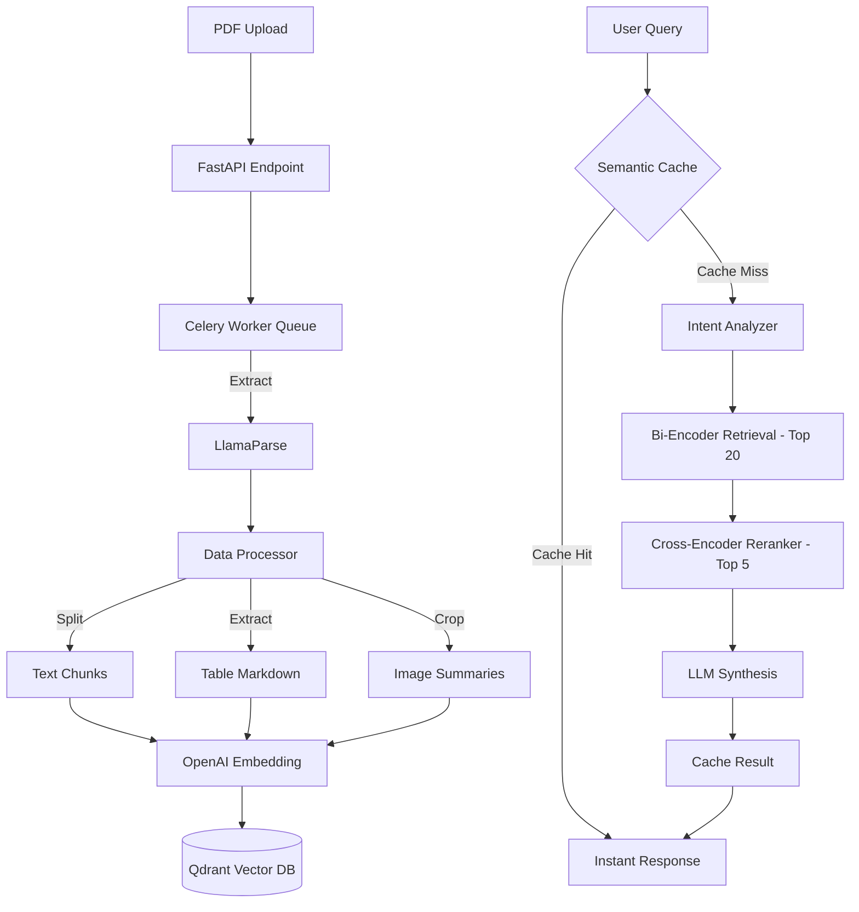

# 🐾 Hyena — Enterprise Financial Document Intelligence

An enterprise-grade **Multimodal RAG** (Retrieval-Augmented Generation) system built to analyze complex financial reports. Powered by LlamaParse, Qdrant Vector DB, and OpenAI, Hyena enables natural-language querying with high-fidelity retrieval across text, tables, and chart images.

  

## 🌟 Key Features & Optimizations

*   **Multimodal RAG Pipelines:** Simultaneously processes and retrieves across Text, Tables, and Images from dense financial PDF reports.
*   **High-Fidelity Ingestion:** Integrates **LlamaParse** to accurately reconstruct multi-page PDF tables into Markdown, eliminating data hallucinations common in standard OCR or naive text splitting.
*   **Two-Stage Retrieval System:**
    *   **Bi-Encoder (Qdrant):** Casts a wide search net to retrieve the Top-20 candidate chunks at high speed.
    *   **Cross-Encoder Reranking (`bge-reranker-v2-m3`):** Semantically re-scores and filters candidates down to the Top-5 most accurate contexts, drastically improving answer precision.
*   **2-Tier Semantic Caching (Redis):** Implements exact-match hashing and cosine-similarity lookup (92% threshold). Resolves repeated or paraphrased queries in ~50ms with zero LLM calls — reducing OpenAI inference costs by an estimated 40–70% under enterprise FAQ workloads.
*   **Asynchronous Ingestion Engine:** Offloads heavy LlamaParse processing and OpenAI vectorized embedding generation to background **Celery workers** and Redis, ensuring the main FastAPI serving threads remain responsive (under 200ms) during bulk document uploads.
*   **Enterprise Security & Reliability:** 
    *   **Payload Filtering:** Strictly scopes vector searches by metadata (e.g., Company Ticker, Fiscal Year), guaranteeing zero context leakage between different corporate reports.
    *   **Sliding Window Rate Limiter:** Protects API endpoints against abuse and manages API token burn rates.
*   **Production-Ready Infrastructure:** A fully Dockerized 5-service stack (FastAPI, Celery, Qdrant, Redis, Nginx) with shared storage volumes and health checks, deployable from zero with a single command.

---

## 🏗 System Architecture



---

## 🚀 Quick Start

### Prerequisites
- Docker & Docker Compose
- API Keys: `OPENAI_API_KEY` and `LLAMA_CLOUD_API_KEY`

### 1. Environment Setup

Clone the repository and copy the example environment file:
```bash
cp .env.example .env
```
Edit `.env` to include your actual API keys. 

### 2. Deploy via Docker (Recommended)

Start the entire 5-service stack (FastAPI Backend, Celery Worker, Redis, Qdrant, Nginx Frontend) in detached mode:
```bash
make up
```
*   **Frontend UI:** `http://localhost:8000`
*   **Swagger API Docs:** `http://localhost:8000/docs`

---

## 💻 Local Development Workflow

If you prefer to run services locally without Docker (e.g., for debugging):

**1. Install Dependencies**
We use `uv` for hyper-fast Python dependency management:
```bash
uv venv
source .venv/bin/activate
uv pip install -r backend/requirements.txt
```

**2. Start Essential Infrastructure**
Spin up only the Qdrant and Redis containers:
```bash
make infra
```

**3. Run the Backend & Worker Concurrenty**
Launch the FastAPI server and Celery background worker:
```bash
make dev-all
```

---

## 📚 API Reference

Here are the primary endpoints for interacting with the Hyena system.

### 1. Document Ingestion (`POST /api/v1/documents/upload`)
Upload financial PDFs. Processing runs asynchronously via Celery.
```bash
curl -X POST "http://localhost:8000/api/v1/documents/upload" \
     -H "Content-Type: multipart/form-data" \
     -F "file=@/path/to/report.pdf" \
     -F "company=FPT" \
     -F "year=2025" \
     -F "quarter=Q4"
```

### 2. Querying (`POST /api/v1/query/`)
Ask contextualized RAG questions against your ingested documents.
```json
// Request
{
  "question": "What is the total revenue for FPT in 2025?",
  "top_k": 5
}

// Response
{
  "answer": "FPT's total revenue in 2025 reached 70,113 billion VND, representing an 11.6% YoY growth [Source #1].",
  "sources": [
    {
      "index": 1,
      "type": "table",
      "company": "FPT",
      "page": 3,
      "score": 0.9829,
      "preview": "| Unit: Billion VND | 2024 | 2025 | YoY |"
    }
  ],
  "question": "What is the total revenue for FPT in 2025?",
  "cached": false
}
```

### 3. Cache Statistics (`GET /api/v1/query/cache/stats`)
Monitor Semantic Cache performance and utilization.
```json
{
  "cache": {
    "exact_entries": 42,
    "semantic_entries": 15,
    "similarity_threshold": 0.92
  }
}
```

---

## 🧪 Testing

The test suite mock-tests the ingestion, extraction, and generation pipelines without burning actual API credits. Run unit tests using pytest:

```bash
uv run python -m pytest backend/tests/ -v
```

---

## 🛠 Tech Stack
*   **Language:** Python 3.12, Vanilla JS
*   **Frameworks:** FastAPI, Celery
*   **AI/ML:** OpenAI (GPT-4o-mini, text-embedding-3-small), BAAI/bge-reranker-v2-m3
*   **Data Processors:** LlamaParse
*   **Storage & DB:** Qdrant (Vector Database), Redis (Message Broker & Cache)
*   **Infra:** Docker Compose, Nginx
